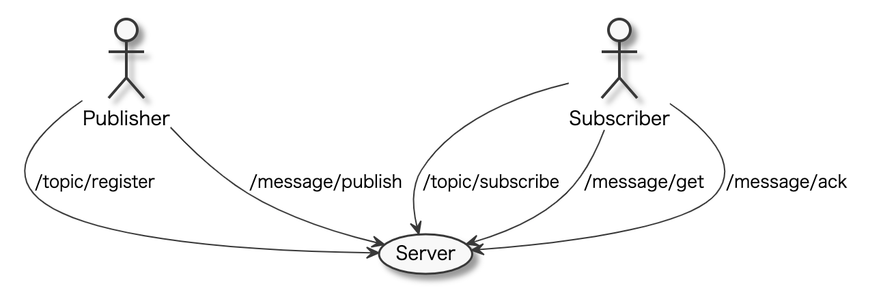
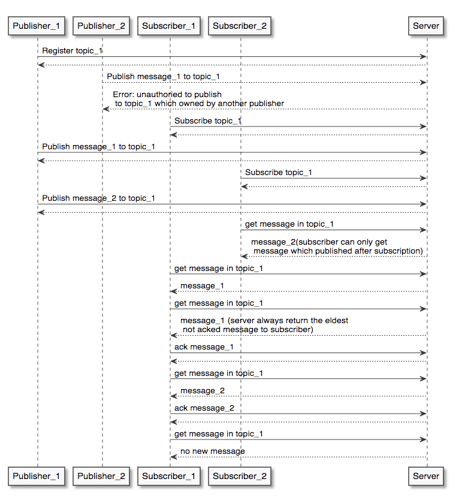

# Features

1. Configurable maximum size of one message
    1. via property `message.length.max.bytes`
       in **[application.properties](src/main/resources/application.properties)**
1. Dockerfile and other necessary materials for quick deployments
    1. [Dockerfile](Dockerfile) for deployments
    1. [docker-compose.yaml](docker-compose.yaml) for local environment
1. Estimated system workload: 400 rps, 99% latency within 0.5s.
    1. Publisher and subscriber concurrent load tests with 200 rps each:
        1. [Publisher Load Test Results](gatling/results/publisher/baseline/index.html)
        1. [Subscriber Load Test Results](gatling/results/subscriber/baseline/index.html)
    1. Please refer
       to [Publisher.scala](gatling/user-files/simulations/com/mercari/merpay/pubsub/Publisher.scala)
       and [Subscriber.scala](gatling/user-files/simulations/com/mercari/merpay/pubsub/Subscriber.scala)
       for more information about the load test plans.
    1. These can be repeated by running `docker-compose up` on the root directory of this project.
1. Messages are **NOT** lost unless hardware-level incident.
1. Example http calls are given with respective documentation:
   1. [ack.http](examples/message/ack.http)
   1. [get.http](examples/message/get.http)
   1. [publish.http](examples/message/publish.http)
   1. [register.http](examples/topic/register.http)
   1. [subscribe.http](examples/topic/subscribe.http)

# Potential Improvements

### Cache layer

We can improve the current throughput performance by committing changes to the state of the server
to a cache layer.

For each client request, we can query/update the cache layer accordingly. We can then respond to
clients and asynchronously persist the state changes to disk.

It is worth to note that, by implementing this feature, we sacrifice the ability to sustain message
loss in the events of hardware failures (disk fails during asynchronous call to persist a message to
disk after the server issues a response to a client).

Therefore, this behaviour should be enabled or disabled via configuration properties so that we can
customize the fault tolerance options of the server.

### Vertical scaling

We can improve the current throughput performance by running the server on a machine with higher
specifications, especially faster I/O.

This might not be the best option since we have a single point of failure.

### Horizontal Scaling

We can deploy multiple instances of the server into a cluster, preferably in different machines for
redundancy purposes.

This particular approach can be tackled similarly to other well-established solutions such as Apache
Kafka.

Rafka maintains the following data elements:

- Subscriber offset (per subscriber)
- Topic messages (per topic)

Therefore, we need to devise a partitioning logic for each of these data elements.

Each instance must be able to serve an individual request as before, but only requiring the view of
its own partitioned data.

The cluster must also be able to load-balance requests to all instances.

### Client Authorization

Publishers and subscribers are currently identified via their IP address, or the IP address of the
last proxy that sent the request. This is not foolproof and can be spoofed.

Instead, we can request clients to be authenticated on a per-request basis via HTTP Authorization
request headers. We can then use the authentication principal as the identity of clients instead of
their IP address.

### Support for Additional Media Types

Only the mime-type 'application/json' and charset 'utf-8' is supported.

In addition, we can provide support for multiple mime-types and charsets.

### Reduced Bandwidth

Traffic is not compressed, resulting in larger network bandwidth utilization.

We can provide support for content encoding to compress the traffic.

### Fault Tolerance

If we scale the cluster horizontally (please see above), messages can be lost in the event of a
hardware-level failures of single nodes in the cluster.

To improve the fault tolerance guarantees of the system we have to also tackle the problem of
maintaining the overall health of the cluster and ensuring data is properly replicated across the
cluster nodes. 

This is a distributed system problem in itself, requiring a leader election
mechanism, replication management, etc.
We could look at well-established solutions such
as Apache ZooKeeper to solve these problems.